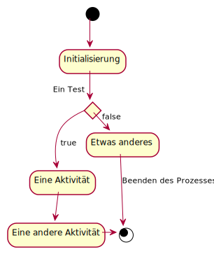

reStructuredText
================

.. seealso::
   * `reStructuredText Primer
     <https://www.sphinx-doc.org/en/master/usage/restructuredtext/basics.html>`_
   * `reStructuredText Quick Reference
     <https://docutils.sourceforge.io/docs/user/rst/quickref.html>`_

Überschriften
-------------

.. code-block:: rest

    Unterstreicht den Titel mit Interpunktionszeichen
    =================================================

    Ändert das Interpunktionszeichen für Untertitel
    -----------------------------------------------

Absätze
-------

Ein Absatz besteht aus einer oder mehreren Zeilen nicht eingerückten Textes.

Sie können durch Leerzeilen vom darüber und darunter liegenden Text getrennt
werden.

.. code-block:: rest

   Ein Absatz besteht aus einer oder mehreren Zeilen nicht eingerückten Textes.

   Sie können durch Leerzeilen vom darüber und darunter liegenden Text getrennt
   werden.

Inline-Auszeichnung
-------------------

*Kursiv*, **fett** und ``vorformattiert``

.. code-block:: rest

   *Kursiv*, **fett** und ``vorformattiert``

Links
-----

Externe Links
~~~~~~~~~~~~~

`Hyperlink <https://en.wikipedia.org/wiki/Hyperlink>`_ `Link`_

.. _Link: https://en.wikipedia.org/wiki/Link_(The_Legend_of_Zelda)

.. code-block:: rest

   `Hyperlink <https://en.wikipedia.org/wiki/Hyperlink>`_ `Link`_

   .. _Link: https://en.wikipedia.org/wiki/Link_(The_Legend_of_Zelda)

.. note::
   Vor einer mit ``..`` beginnenden Direktive muss immer eine Leerzeile
   stehen.

Interne Links
~~~~~~~~~~~~~

Stellen mit Querverweisen
:::::::::::::::::::::::::

.. _my-reference-label:

Zu referenzierender Abschnitt
.............................

Um auf einen Abschnitt zu verweisen, verwendet :ref:`my-reference-label`.

.. code-block:: rest

   .. _my-reference-label:

   Zu referenzierender Abschnitt
   .............................

   Um auf einen Abschnitt zu verweisen, verwendet :ref:`my-reference-label`.

Auf Dokumente referenzieren
:::::::::::::::::::::::::::

Link zur :doc:`Startseite <../index>` oder zu :doc:`docstrings`.

.. code-block:: rest

   Link zur :doc:`Startseite <../index>` oder zu :doc:`docstrings`.

Dokumente herunterladen
:::::::::::::::::::::::

Link zu einem Dokument, das nicht von Sohinx gerendert werden soll, :abbr:`z.B.
(zum Beispiel)` zu :download:`autodoc-examples.rst`.

.. code-block:: rest

   Link zu einem Dokument, das nicht von Sohinx gerendert werden soll,
   :abbr:`z.B. (zum Beispiel)` zu :download:`docstrings-example.rst`.

Bilder
------

.. code-block:: rest

   .. image:: uml/activity-diagram.svg

Andere semantische Auszeichnungen
~~~~~~~~~~~~~~~~~~~~~~~~~~~~~~~~~

Dateiliste
::::::::::

:file:`/Users/{NAME}/python-basics`

.. code-block:: rest

   :file:`/Users/{NAME}/python-basics`

Menüauswahlen und GUI-Beschriftungen
::::::::::::::::::::::::::::::::::::

#. :menuselection:`Datei --> Speichern unter …`
#. :guilabel:`&Abschicken`

.. code-block:: rest

   #. :menuselection:`Datei --> Speichern unter …`
   #. :guilabel:`&Abschicken`

Listen
------

Nummerierte Listen
------------------

#. Erstens
#. Zweitens
#. Drittens

.. code-block:: rest

   #. Erstens
   #. Zweitens
   #. Drittens

Unnummerierte Listen
~~~~~~~~~~~~~~~~~~~~

* Jeder Eintrag in einer Liste beginnt mit einem Asterisk (``*``)
* Listeneinträge können über mehrere Zeilen angezeigt werden, solange die
  Listeneinträge eingerückt bleiben.

.. code-block:: rest

   * Jeder Eintrag in einer Liste beginnt mit einem Asterisk (``*``)
   * Listeneinträge können über mehrere Zeilen angezeigt werden, solange die
     Listeneinträge eingerückt bleiben.

Definitionsliste
~~~~~~~~~~~~~~~~

Term
    Definition des Begriffs
EIn anderer Term
   … und seine Definition

.. code-block:: rest

   Term
       Definition des Begriffs
   EIn anderer Term
      … und seine Definition

Verschachtelte Listen
---------------------

* Listen können auch verschachtelt werden

  * und Unterpunkte enthalten

.. code-block:: rest

   * Listen können auch verschachtelt werden

     * und Unterpunkte enthalten

Literarische Blöcke
-------------------

    »Blockmarkierungen sehen aus wie Absätze, sind aber mit einem oder mehreren
    Leerzeichen eingerückt.«

.. code-block:: rest

       »Blockmarkierungen sehen aus wie Absätze, sind aber mit einem oder mehreren
       Leerzeichen eingerückt.«

Zeilenblöcke
------------

| Durch das Pipe-Zeichen wird dies zu einer Zeile.
| Und dies wird eine weitere Zeile sein.

.. code-block:: rest

   | Durch das Pipe-Zeichen wird dies zu einer Zeile.
   | Und dies wird eine weitere Zeile sein.

Code-Blöcke
-----------

Codeblöcke werden mit zwei Doppelpunkten eingeleitet und eingerückt::

    import docutils
    print help(docutils)

>>> print 'Aber Doctests beginnen mit ">>>" und müssen nicht eingerückt werden.'

.. code-block:: rest

   Codeblöcke werden mit zwei Doppelpunkten eingeleitet und eingerückt::

       import docutils
       print help(docutils)

   >>> print 'Aber Doctests beginnen mit ">>>" und müssen nicht eingerückt werden.'

.. seealso::
   :doc:`code-blocks`

Tabellen
--------

+--------------------+--------------------+--------------------+--------------------+
| Spaltenüberschrift | Spaltenüberschrift | Spaltenüberschrift | Spaltenüberschrift |
+====================+====================+====================+====================+
| Zeile 1,           | Zeile 1,           | Zeile 1,           | Zeile 1,           |
| Spalte 1           | Spalte 2           | Spalte 3           | Spalte 4           |
+--------------------+--------------------+--------------------+--------------------+
| Zeile 2,           | Zeile 2,           | Zeile 2,                                |
| Spalte 1           | Spalte 2           | Spalte 3,  colspan 2                    |
+--------------------+--------------------+--------------------+--------------------+
| Zeile 3,           | Zeile 3,           | Zeile 3,           | Zeile 4,           |
| Spalte 1           | Spalte 2           | Spalte 3,          | Spalte 4           |
+--------------------+--------------------+ rowspan 2          +--------------------+
| Zeile 5,           | Zeile 5,           |                    | Zeile 5,           |
| Spalte 1           | Spalte 2           |                    | Spalte 4           |
+--------------------+--------------------+--------------------+--------------------+

.. code-block:: rest

   +--------------------+--------------------+--------------------+--------------------+
   | Spaltenüberschrift | Spaltenüberschrift | Spaltenüberschrift | Spaltenüberschrift |
   +====================+====================+====================+====================+
   | Zeile 1,           | Zeile 1,           | Zeile 1,           | Zeile 1,           |
   | Spalte 1           | Spalte 2           | Spalte 3           | Spalte 4           |
   +--------------------+--------------------+--------------------+--------------------+
   | Zeile 2,           | Zeile 2,           | Zeile 2,                                |
   | Spalte 1           | Spalte 2           | Spalte 3,  colspan 2                    |
   +--------------------+--------------------+--------------------+--------------------+
   | Zeile 3,           | Zeile 3,           | Zeile 3,           | Zeile 4,           |
   | Spalte 1           | Spalte 2           | Spalte 3,          | Spalte 4           |
   +--------------------+--------------------+ rowspan 2          +--------------------+
   | Zeile 5,           | Zeile 5,           |                    | Zeile 5,           |
   | Spalte 1           | Spalte 2           |                    | Spalte 4           |
   +--------------------+--------------------+--------------------+--------------------+

Kommentare
----------

.. Ein Kommentarblock beginnt mit zwei Punkten und kann weiter eingerückt werden.

.. code-block:: rest

   .. Ein Kommentarblock beginnt mit zwei Punkten und kann weiter eingerückt werden.
