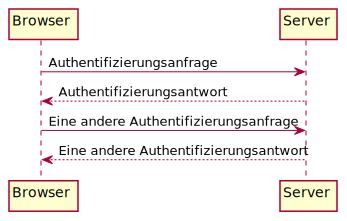
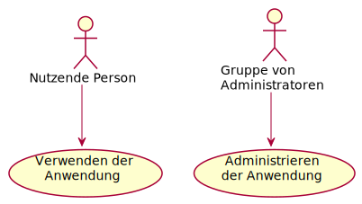

Unified Modeling Language (UML)
===============================

Installation
------------

#. Installiert `plantuml <https://plantuml.com/starting>`_:

   .. tab:: Linux

       .. code-block:: console

         $ sudo apt install plantuml

   .. tab:: macOS

      .. code-block:: console

         $ brew install plantuml

   .. tab:: Windows

      .. code-block:: ps1

         $ choco install plantuml

#. Installiert `sphinxcontrib-plantuml
   <https://pypi.org/project/sphinxcontrib-plantuml/>`_:

   .. tab:: Linux

      .. code-block:: console

         $ python -m pip install sphinxcontrib-plantuml

   .. tab:: macOS

      .. code-block:: console

         $ python -m pip install sphinxcontrib-plantuml

   .. tab:: Windows

      .. code-block:: ps1con

         C:> python -m pip install sphinxcontrib-plantuml

#. Konfiguriert Sphinx in der ``conf.py``-Datei:

   .. code-block:: python

      extensions = [..., "sphinxcontrib.plantuml"]

      plantuml = "/PATH/TO/PLANTUML"

   .. note::
      Auch in Windows werden in der Pfadangabe ``/`` angegeben.

Sequenzdiagramm
---------------

.. code-block:: rest

   .. uml::

       Browser -> Server: Authentifizierungsanfrage
       Server --> Browser: Authentifizierungsantwort

       Browser -> Server: Eine andere Authentifizierungsanfrage
       Browser <-- Server: Eine andere Authentifizierungsantwort

``->``
    wird verwendet, um eine Nachricht zwischen zwei Akteuren zu zeichnen. Die
    Akteure müssen nicht explizit deklariert werden.
``-->``
     wird verwendet, um eine gepunktete Linie zu zeichnen.
``<- und <--``
    verändert die Zeichnung nicht, kann aber die Lesbarkeit erhöhen.

Anwendungsfall-Diagramm
-----------------------

.. code-block:: rest

   .. uml::

      :Nutzende Person: --> (Verwendung)
      "Gruppe von\nAdministratoren" as Admin
      "Verwenden der\nAnwendung" as (Verwendung)
      Admin --> (Administrieren\nder Anwendung)

Anwendungsfälle werden von runden Klammern ``()`` umschlossen und ähneln einem
Oval.

Alternativ kann auch das Schlüsselwort ``usecase`` verwendet werden, um einen
Anwendungsfall zu definieren. Darüber hinaus ist es möglich, mit dem
Schlüsselwort ``as`` einen Alias zu definieren. Dieser Alias kann dann bei der
Definition von Beziehungen verwendet werden.

Mit ``\n`` könnt ihr Zeilenumbrüche in den Namen der Anwendungsfälle einfügen.

Aktivitätsdiagramm
------------------

``(*)``
    Start- und Endknoten eines Aktivitätsdiagramms.

    ``(*top)``
        In einigen Fällen kann dies verwendet werden um den Startpunkt an den
        Anfang eines Diagramms zu verschieben.

``-->``
    definiert eine Aktivität

    ``-down->``
        Pfeil nach unten (Standardwert)
    ``-right-> or ->``
        Pfeil nach rechts
    ``-left->``
        Pfeil nach links
    ``-up->``
        Pfeil nach oben

``if``, ``then``, ``else``
    Schlüsselworte für die Definition von Verzweigungen.

    Beispiel:

    .. code-block:: rest

       .. uml::

           (*) --> "Initialisierung"
           if "ein Test" then
           -->[wahr] "Eine Aktivität"
           --> "Eine andere Aktivität"
           -right-> (*)
           else
           ->[falsch] "Etwas anderes"
           -->[Ende des Prozesses] (*)
           endif

    .. image:: activity-diagram.svg

``fork``, ``fork again`` und ``end fork`` oder ``end merge``
    Schlüsselworte für die parallele Verarbeitung.

    Beispiel:

    .. code-block:: rest

       .. uml::

          start
          fork
            :Aktion 1;
          fork again
            :Aktion 2;
          end fork
          stop

    .. image:: parallel.svg
