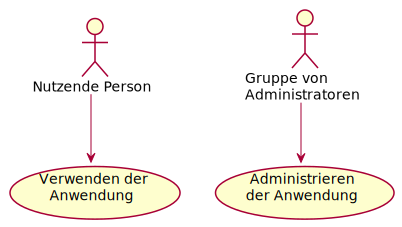

Anwendungsfall-Diagramm
=======================

    
.. code-block:: rest

   .. uml::
    
      :Nutzende Person: --> (Verwendung)
      "Gruppe von\nAdministratoren" as Admin
      "Verwenden der\nAnwendung" as (Verwendung)
      Admin --> (Administrieren\nder Anwendung)

Anwendungsfälle werden von runden Klammern ``()`` umschlossen und ähneln einem
Oval.

Alternativ kann auch das Schlüsselwort ``usecase`` verwendet werden, um einen
Anwendungsfall zu definieren. Darüber hinaus ist es möglich, mit dem
Schlüsselwort ``as`` einen Alias zu definieren. Dieser Alias kann dann bei der
Definition von Beziehungen verwendet werden.

Mit ``\n`` könnt ihr Zeilenumbrüche in den Namen der Anwendungsfälle einfügen.
