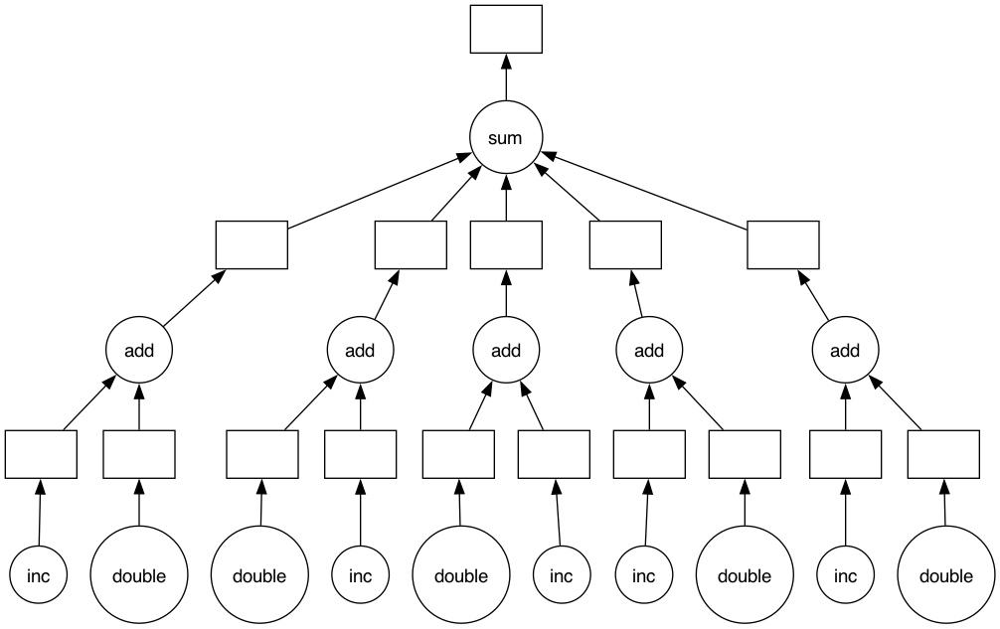

Dekoratoren
===========

Funktionen können auch als Argumente an andere Funktionen übergeben werden und
die Ergebnisse anderer Funktionen zurückgegeben. So ist es :abbr:`z.B. (zum
Beispiel)` möglich, eine Python-Funktion zu schreiben, die eine andere Funktion
als Parameter annimmt, sie in eine andere Funktion einbettet, die etwas
Ähnliches tut, und dann die neue Funktion zurückgibt. Diese neue Kombination
kann dann anstelle der ursprünglichen Funktion verwendet werden:

.. code-block:: pycon
   :linenos:

   >>> def inf(func):
   ...     print("Information about", func.__name__)
   ...     def details(*args):
   ...         print("Execute function", func.__name__, "with the argument(s)")
   ...         return func(*args)
   ...     return details
   ...
   >>> def my_func(*params):
   ...     print(params)
   ...
   >>> my_func = inf(my_func)
   Information about my_func
   >>> my_func("Hello", "Pythonistas!")
   Execute function my_func with the argument(s)
   ('Hello', 'Pythonistas!')

Zeile 1
    Die ``inf``-Funktion gibt den Namen der Funktion, die sie umhüllt, aus.
Zeile 12
    Wenn sie fertig ist, gibt die ``inf``-Funktion die umhüllte Funktion zurück.

Ein Dekorator ist `syntaktischer Zucker
<https://de.wikipedia.org/wiki/Syntaktischer_Zucker>`_ für diesen Prozess und
ermöglicht euch, eine Funktion mit einem einzeiligen Zusatz in eine andere zu
packen. Ihr erhaltet immer noch genau den gleichen Effekt wie beim vorherigen
Code, aber der resultierende Code ist viel sauberer und leichter zu lesen. Die
Verwendung eines Dekorators besteht ganz einfach aus zwei Teilen:

#. der Definition der Funktion, die andere Funktionen umhüllen oder
   *dekorieren* soll, und
#. der Verwendung eines ``@``, gefolgt von dem Dekorator, unmittelbar bevor die
   umhüllte Funktion definiert wird.

Die Dekorator-Funktion sollte eine Funktion als Parameter annehmen und eine
Funktion zurückgeben, wie folgt:

.. code-block:: pycon
   :linenos:

   >>> @inf
   ... def my_func(*params):
   ...     print(params)
   ...
   Information about my_func
   >>> my_func("Hello", "Pythonistas!")
   Execute function my_func with the argument(s)
   ('Hello', 'Pythonistas!')

Zeile 1
    Die Funktion ``my_func`` wird mit ``@inf`` dekoriert.
Zeile 8
    Die umhüllte Funktion wird aufgerufen, nachdem die Dekorator-Funktion fertig
    ist.

``functools``
-------------

Das Python-:mod:`functools`-Modul ist für Funktionen höherer Ordnung gedacht,
also Funktionen, die auf andere Funktionen wirken oder diese zurückgeben. Meist
könnt ihr sie als Dekoratoren verwenden, so :abbr:`u.a. (unter anderem)`:

:func:`functools.cache`
    Einfacher, leichtgewichtiger, Cache für Funktionen ab Python ≥ 3.9, der
    manchmal auch *memoize* genannt wird. Er gibt dasselbe zurück wie
    :func:`functools.lru_cache` mit dem Parameter ``maxsize=None``, wobei
    zusätzlich ein :doc:`/types/dicts` mit den Funktionsargumenten erstellt
    wird. Da alte Werte nie gelöscht werden müssen, ist diese Funktion dann
    auch kleiner und schneller. Ein Beispiel:

    .. code-block:: pycon
       :linenos:

       >>> from timeit import timeit
       >>> from functools import cache
       >>> @cache
       ... def factorial(n):
       ...     return n * factorial(n - 1) if n else 1
       ...
       >>> timeit("factorial(10)", number=1, globals=globals())
       8.74977558851242e-06
       >>> timeit("factorial(12)", number=1, globals=globals())
       4.041939973831177e-06
       >>> timeit("factorial(12)", number=1, globals=globals())
       1.8328428268432617e-06

    Zeile 1
        importiert das :mod:`timeit`-Modul zum Messen der Messen der
        Ausführungszeit.
    Zeile 2
        importiert :func:`functools.cache`.
    Zeile 3
        Der ``@cache``-Dekorator wird verwendet, um Zwischenergebnisse zu
        speichern, die dann erneut verwendet werden können. In unserem Fall
        wird die Ausführungsgeschwindigkeit ungefähr verzehnfacht.
    Zeile 7
        :func:`timeit.timeit` misst die Zeit eines Aufrufs.
    Zeile 9
        Nur zwei weitere rekursive Aufrufe müssen durchgeführt werden, da
        ``factorial(10)`` bereits zwischengespeichert ist.

:func:`functools.singledispatch`
    wandelt eine Funktion in eine generische Funktion um. Um eine generische
    Funktion zu definieren, wird diese mit dem Dekorator ``@singledispatch``
    versehen:

    .. code-block:: pycon

       >>> from functools import singledispatch
       >>>
       >>> @singledispatch
       ... def multiply(a, b):
       ...     raise NotImplementedError("Unsupported type")
       ...

    Um der Funktion überladene Implementierungen hinzuzufügen, könnt ihr
    :func:`register` der generischen Funktion als Dekorator verwenden:

    .. code-block:: pycon

       >>> @multiply.register(float)
       ... def _(a, b):
       ...     print(a * b)
       ...
       >>> @multiply.register(str)
       ... def _(a, b):
       ...     print(float(a) * float(b))
       ...
       >>> multiply(7.0, 0.6)
       4.2
       >>> multiply("7.0", "0.6")
       4.2

    Bei Funktionen, die mit Typen annotiert sind, leitet der Dekorator den Typ
    des ersten Arguments automatisch ab.

:func:`functools.wraps`
    Dieser Dekorator lässt die Wrapper-Funktion so, so wie die ursprüngliche
    Funktion aussehen mit ihren Namen und ihren Eigenschaften.

    .. code-block:: pycon

        >>> from functools import wraps
        >>> def my_decorator(f):
        ...     @wraps(f)
        ...     def wrapper(*args, **kwargs):
        ...         """Wrapper docstring"""
        ...         print("Call decorated function")
        ...         return f(*args, **kwargs)
        ...     return wrapper
        ...
        >>> @my_decorator
        ... def example():
        ...     """Example docstring"""
        ...     print("Call example function")
        ...
        >>> example.__name__
        'example'
        >>> example.__doc__
        'Example docstring'

    Ohne ``@wraps``-Dekorator wäre stattdessen Name und Docstring der
    ``wrapper``-Methode zurückgegeben worden:

    .. code-block:: pycon

        >>> example.__name__
        'wrapper'
        >>> example.__doc__
        'Wrapper docstring'

Weitere typische Anwendungen für Python-Dekoratoren
---------------------------------------------------

Andere Python-Compiler
~~~~~~~~~~~~~~~~~~~~~~

Python-Compiler wie :abbr:`z. B. (zum Beispiel)` `Numba
<https://numba.pydata.org/>`_ können mit einem Dekorator verwendet werden:

.. code-block:: python

   @numba.jit(nopython=True)
   def dist(x, y):
       """Calculate the distance"""
       dist = 0
       for i in range(len(x)):
           dist += (x[i] - y[i]) ** 2
       return dist

.. seealso::
   * :ref:`/performance/index.rst#numba`

Parallelisierung
~~~~~~~~~~~~~~~~

Die sequenzielle Ausführung unabhängiger Pipeline-Schritte nutzt die
Rechenkapazitäten von Prozessoren nicht optimal aus. Der Dekorator
`@dask.delayed <https://docs.dask.org/en/stable/delayed.html#decorator>`_
erstellt einen gerichteten azyklischen Graphen (englisch :abbr:`DAG (directed
acyclic graph)`), um die Aufgaben parallel auszuführen, was zur Verkürzung der
Gesamtlaufzeit beiträgt:

.. code-block:: pycon

   >>> import dask
   >>> @dask.delayed
   ... def inc(x):
   ...     return x + 1
   ...
   >>> @dask.delayed
   ... def double(x):
   ...     return x * 2
   ...
   >>> @dask.delayed
   ... def add(x, y):
   ...     return x + y
   ...
   >>> data = range(1, 6)
   >>> output = []
   >>> for x in data:
   ...     a = inc(x)
   ...     b = double(x)
   ...     c = add(a, b)
   ...     output.append(c)
   ...
   >>> total = dask.delayed(sum)(output)
   >>> total.compute()
   50
   >>> total.visualize()
   <IPython.core.display.Image object>

Memory-Profiling
~~~~~~~~~~~~~~~~

Der Dekorator ``@memory_profiler.profile`` dient dazu, den Speicherverbrauch zu
messen. Dabei wird die umschlossene Funktion Schritt für Schritt überwacht und
dabei für jedem einzelnen Schritt der RAM-Verbrauch bzw. der freigegebene
Speicher beobachtet:

.. code-block:: python
   :linenos:

   from memory_profiler import profile

   @profile
   def my_func():
       a = [1] * (10**6)
       b = [2] * (2 * 10**7)
       del b
       return a

Die Ausgabe kann dann so aussehen:

.. code-block:: console

   Line #    Mem usage    Increment   Line Contents
   ================================================
        4     67.3 MiB     67.3 MiB   @profile
        5                             def my_func():
        6     74.8 MiB      7.5 MiB       a = [1] * (10 ** 6)
        7    227.4 MiB    152.6 MiB       b = [2] * (2 * 10 ** 7)
        8     74.9 MiB      0.0 MiB       del b
        9     74.9 MiB      0.0 MiB       return a

.. seealso::
   * `memory-profiler
     <https://www.python4data.science/de/latest/performance/ipython-profiler.html#Speicherprofil-erstellen:-%memit-und-%mprun>`_
